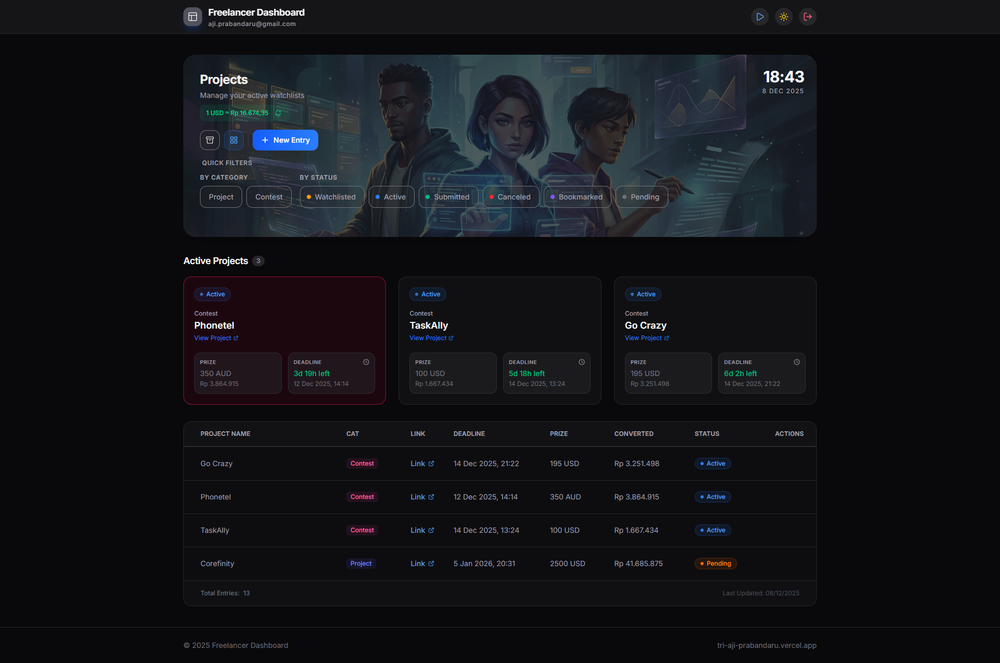

# Freelancer Dashboard

A custom-built web application designed to streamline the freelance job hunting process. This responsive dashboard helps users track freelance gigs and design contests, providing real-time data on potential earnings and deadlines to simplify decision-making.

## � Preview



## �🚀 Key Features

### Core Features
- **Multi-Currency Converter**: Automatically converts prize values from global currencies (USD, EUR, GBP, AUD, INR, CAD) to IDR using real-time exchange rates
- **Smart Filtering**: Quick filters to sort opportunities by Category (Project vs. Contest) or Status (Watchlisted, Active, Submitted, Pending, Bookmarked, Canceled)
- **Deadline Tracking**: Clear visualization of project deadlines with countdown timers
- **Dynamic Data Table**: Sortable columns with persistent sort preferences (saved to server)

### Active Projects Card View
- **Visual Card Grid**: Active projects displayed as cards with key information at a glance
- **Urgency Indicators**: Cards turn red when deadline is less than 4 days away
- **Sorted by Priority**: Cards automatically ordered by deadline (earliest first)
- **In-Card Editing**: Update status and deadline directly from the card view

### User Experience
- **Interactive Tutorial**: Guided onboarding for new users (auto-triggers on first sign-up)
- **Archive System**: Toggle between active and archived projects
- **Dark/Light Mode**: Persistent theme preference with modern UI aesthetics
- **Responsive Design**: Optimized for desktop and mobile devices
- **Hero Section**: Dynamic header with real-time clock display

### Data Management
- **Supabase Integration**: Real-time database with Row Level Security (RLS)
- **User Preferences**: Sort settings persisted to server across devices
- **JSON Export/Import**: Backup and restore project data
- **Custom Columns**: Add additional columns to track extra data

## 🛠️ Technical Stack

| Technology | Purpose |
|------------|---------|
| React + TypeScript | Frontend framework |
| Vite | Build tool |
| Tailwind CSS | Styling |
| Lucide React | Icons |
| Supabase | Backend, Auth & Database |
| React Joyride | Interactive tutorials |

## 🏃‍♂️ Getting Started

### Prerequisites
- Node.js 18+
- Supabase account with project set up

### Installation

1. **Clone the repository**
   ```bash
   git clone https://github.com/yourusername/freelancer-dashboard.git
   cd freelancer-dashboard
   ```

2. **Install dependencies**
   ```bash
   npm install
   ```

3. **Set up environment variables**
   ```bash
   cp .env.example .env
   # Edit .env with your Supabase credentials
   ```

4. **Set up Supabase database**
   - Run `schema.sql` in Supabase SQL Editor to create the `projects` table
   - Run `setup_profiles_table.sql` to create the `profiles` table (required for tutorial & preferences)

5. **Run the development server**
   ```bash
   npm run dev
   ```

## 📁 Project Structure

```
src/
├── assets/           # Images and static assets
├── components/
│   ├── board/        # Active project cards
│   ├── shared/       # Reusable components (PortalDropdown, DatePicker)
│   └── table/        # Table components (TableCell, TableRow, etc.)
├── context/          # Auth context
├── lib/              # Supabase client
└── sections/         # Main page sections (Table, Auth)
```

## 🗄️ Database Schema

### Tables
- **projects**: Stores all project/contest entries
- **profiles**: Stores user preferences and tutorial status

See `schema.sql` and `setup_profiles_table.sql` for complete schema.

## 🌐 Deployment

**Live Demo**: [freelancer-dashboard-xi.vercel.app](https://freelancer-dashboard-xi.vercel.app/)

Deployed on Vercel with automatic deployments from main branch.

## 👤 Author

**Tri Aji Prabandaru**  
[Portfolio Website](https://tri-aji-prabandaru.vercel.app/)

---

## 📝 License

MIT